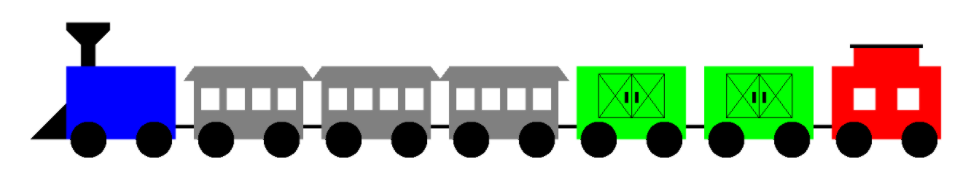
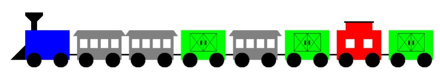
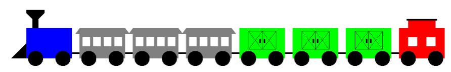

# 10.2-Train

# TRAINS!!! 
[AWT Documentation](https://docs.oracle.com/javase/7/docs/api/java/awt/Graphics.html)




  
 
  
 
 
- Class RailCar was created first to create a fundamental car with wheels. 
- Classes FreightCar, Locomotive, PassengerCar, and Caboose were written as subclasses 
of the RailCar superclass. 
- Every one of the subclasses used a drawCar method that first used super.drawCar(g) to 
draw the RailCar object that is part of every subclass of RailCar. 
- Then all of these classes were tested, thrown in an array, and displayed.  This demonstrated 
how polymorphism can select the correct method for each object. 
 
 
The essence of this assignment is to create a Train class that neatly encapsulates all the necessary classes in one container.  Sometimes student underestimate the challenge of an assignment. This may even cause concentration on other academic subjects that seem more pressing. This assignment is challenging. The 80-point version is relatively easy, but for the 100-point version you need to overcome some interesting obstacles that will test if you truly understand inheritance. It is an ideal team project for two or three people to work on together and solve the problems. 
 
## 80-Point Version Specifics  
The 80-Point version requires that all methods connected with the train program are contained in a Train class or that they are contained in a class that has its object as attribute in the Train class. 
 
```java
public class Display extends JPanel{
	public Display(){}
	public void paintComponent(Graphics g){
		super.paintComponent(g); 
		setBackground(Color.WHITE);
		Train train = new Train(100,300); 
       train.addCar("Locomotive",Color.blue); 
       train.addCar("PassengerCar",Color.gray); 
       train.addCar("PassengerCar",Color.gray); 
       train.addCar("FreightCar",Color.green); 
       train.addCar("PassengerCar",Color.gray); 
       train.addCar("FreightCar",Color.green); 
       train.addCar("Caboose",Color.red); 
       train.addCar("FreightCar",Color.green); 
       train.showCars(g); 
	}
}
```
The provided testing file shows that the program starts by creating a Train object. Well there is no Train class right now. The parameters information of (100,300) is the top-left coordinate position of the train.  

The testing program continues and then adds eight cars to the train. Notice that the only thing specified for each new car is the color. For the 80-Point version each new car is added to the end of the train. In the starting program method add created a new car objects with a specified color and a specified location. This has changed. Every car has a location in the whole train that is relative to the front of the train.  
 
The Train class requires an addCar method that adds a new RailCar object to a railCars dynamic array. The 80-Point version has only one addCar method and it places each new RailCar object at the rear of the train. 
 
The Train class also needs a showCars method, which displays the car in the sequence that the cars were added. The very first car added to the Train object is displayed at the (x,y) coordinate that was provided with the instantiation of the new Train object. 
 
### 80-Point Version Output 

 
 
## 100-Point Version Specifics  
First look at the provided test program, Lab14bv100.java and compare it to the 80-Point version. At a quick, first glance the two files may appear identical. Both versions start by creating a Train object and both versions place it at the same location.  Both versions add eight RailCar objects. 
 
The main difference is that in the 100-Point version, two of the cars use a second, overloaded 
addCar method that inserts a new RailCar object at a specified location. This is the 100-point 
challenge. How do you put a new car between two existing cars and keep every else in sequence? 
 ```java
public class Display extends JPanel{
	public Display(){}
	public void paintComponent(Graphics g){
		super.paintComponent(g); 
		setBackground(Color.WHITE);
		Train train = new Train(100,300); 
		train.addCar("Locomotive",Color.blue); 
		train.addCar("PassengerCar",Color.gray); 
		train.addCar("PassengerCar",Color.gray); 
		train.addCar("FreightCar",Color.green); 
		train.addCar(3,"PassengerCar",Color.gray); 
		train.addCar("FreightCar",Color.green); 
		train.addCar("Caboose",Color.red); 
		train.addCar(6,"FreightCar",Color.green); 
		train.showCars(g); 
	}
}
```
 
 
 
The Train class requires an addCar method that adds a new RailCar object to a railCars dynamic array and places it at the end of the train. The 100-Point version also has a second addCar method, which places a new RailCar object at a sequence number in the train. The first position, occupied by the locomotive is position 0. 
 
The Train class also needs a showCars method, which displays the car in the sequence that the cars were added. The very first car added to the Train object is displayed at the (x,y) coordinate that was provided with the instantiation of the new Train object. 
 
 
 
### 100-Point Version Output 



It was stated earlier that there are some inheritance issues that can cause a problem. Your teacher will decide if and when to you give you appropriate hints to solve this problem. You may not get any help at all. The only hint given in the lab assignment is to watch out for this 100-Point version output. 
This output shows some very confused RailCar objects. It is the result of not handling inheritance 
concerns properly. That is the only hint you get here. Anything else, your teacher will decide. 
 
 
 
  
